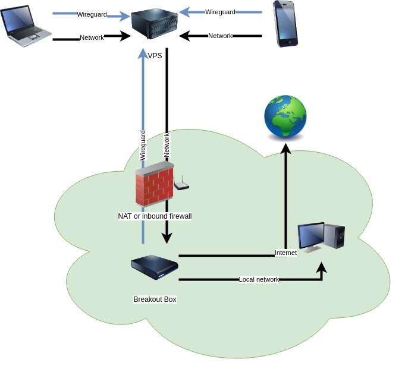

# Breakout Box
An awesome reverse VPN using Wireguard! No port forwarding required.

## A reverse VPN?

A Breakout Box is a box you put on a network. The box connects to a publicly available server. Clients connect to the server, and all their traffic is routed through the server and the box. 



So it's a VPN, but the reverse. Instead of you connecting to a VPN box, the VPN box connects to you. No ports to open, and keep your home network private from outside eyes. A reverse VPN - or a Breakout Box!


## What should I use this for?
There are many use cases for which a Breakout Box is a great tool.

1. Home network everywhere - keep your phone or laptop connected to your home network using Wireguard, and access local services
2. Remote support - use a Breakout Box to securely perform remote support, while working from home.
3. Media streaming - use a Breakout Box in a friend's house to access georestricted services.

You should not put Breakout Boxes on networks where you don't have permission to put them.

## Requirements
You need:

1. A box to put in a network. This can be a Raspberry Pi, laptop of virtual machine running Linux. It must have Wireguard installed and use systemd.
2. A public server, like a VPS running Linux. It must have Wireguard installed and use systemd. You must be able to SSH to it, and the UDP port on which you have Wireguard running (default: 51280) must be accessible by your box and clients.
3. A computer from which you do the installation. We use Ansible for the installation, so you must [install Ansible](https://docs.ansible.com/ansible/latest/installation_guide/intro_installation.html). For most setups, including the example below, you also need [to have Wireguard installed locally](https://www.wireguard.com/install/).

## Set up a Breakout Box
In this example, the server's IP address is `48.24.48.12` and the box's IP address is `192.168.1.25`.

1. Clone this repository
2. Create an Ansible hosts inventory `hosts.yml` in the project root, like the example below. You may need to [add/change some details in your host inventory](https://docs.ansible.com/ansible/latest/user_guide/intro_inventory.html) to allow Ansible to be able to configure your box and server.
```yaml
all:
  hosts:
    box:
      ansible_host: 192.168.1.25
      ansible_port: 22
      ansible_user: root
    server:
      ansible_host: 48.24.48.12
      ansible_port: 22
      ansible_user: root
```

3. Create a new Ansible Vault to store your server's and box's private keys: `ansible-vault create secrets.yml`
4. Create a Wireguard keypair for your box, and one for your server. On Linux systems (the first is your private key, the second your public key):
```sh
$ wg genkey | tee /dev/tty | wg pubkey  # box
YDq+9pGp6GRDfn+WPgWD9aAs2lYLdAjSEez8P/HnNXM=
s1cTi//DTWPeZKUrB3cgIaybAZIVyhE3kE3LD1dFn1A=
$ wg genkey | tee /dev/tty | wg pubkey  # server
4EYcQaynpp62OvN9hpVQiu0V6VvrocSM4uOP5Euh01U=
eH0G5luSMXPIAG4KX7pc+CwuHiBx0hAC0VjUDYgOLEs=
```
5. Edit your Ansible Vault (`ansible-vault edit secrets.yml`) to look like this with your own keys:
```yaml
box_wg_private_key: YDq+9pGp6GRDfn+WPgWD9aAs2lYLdAjSEez8P/HnNXM=
box_wg_public_key: s1cTi//DTWPeZKUrB3cgIaybAZIVyhE3kE3LD1dFn1A=

server_wg_private_key: 4EYcQaynpp62OvN9hpVQiu0V6VvrocSM4uOP5Euh01U=
server_wg_public_key: eH0G5luSMXPIAG4KX7pc+CwuHiBx0hAC0VjUDYgOLEs=

```
6. Add any clients for your Wireguard server in `overrides.yml` (you can update this file later to add more clients):
```yaml
clients:
- comment: My laptop
  public_key: CwCyNjshTJhblgpVNxlOtAHJ0ZMtDC2fNU5pEW4AFSg=
  allowed_ips:
  - 172.16.22.10/24  # Pick something in the 172.16.22.0/24 range
- comment: My phone
  public_key: 4bB4KNybk51SYk0amjwpiGuILbUTpwRZtcYlgYvcgGY=
  allowed_ips:
  - 172.16.22.25/24
```
7. From your root directory, run `ansible-playbook --ask-vault-pass -i hosts.yml main.yml`
8. Your Breakout Box is ready. Test to see whether your clients route their traffic through the box.

After you've successfully tested this, you can place your Breakout Box anywhere to route your traffic through it. If you want to add or remove clients later, you can update update `overrides.yml` and only update your server with `ansible-playbook --limit server --ask-vault-pass -i hosts.yml main.yml`. Your box doesn't have to be there to add clients!

## Example client configuration

No special Wireguard configuration is necessary - it's as if you're connecting to the server's Wireguard. An example is below - don't forget to note your target network's DNS.

```
[Interface]
PrivateKey = KPZx5yQ8w1bEvouIDRUJR1s0yJjrGVKOVOzq9+lgMm4=
Address = 172.16.22.42/32
DNS = 192.168.1.1

[Peer]
PublicKey = wpTH7DD6OnhM5PK0oMomD9CoHgGPRB+KG2GfrRaug04=
AllowedIPs = 0.0.0.0/0, ::/0
Endpoint = 48.24.48.12:51820
```

## I don't want to use Ansible!
We're using Ansible here only for convenience, because it makes setting up multiple systems easy. But you can set it up manually as well. The "magic" behind a Breakout Box is contained in only four files:

* The server's [Wireguard configuration](server/templates/wg.conf.j2) which routes all network through the box's incoming connection.
* The server's [breakout systemd service](server/../box/templates/breakout-box.service.j2) which sets up the Wireguard interface, and sets up a separate routing table for the Wireguard traffic.
* The box's [Wireguard configuration](box/templates/wg.conf.j2) 
* The box's [breakout-box systemd service](box/templates/breakout-box.service.j2) which NATs all traffic coming in to the Wireguard interface to its outgoing network.
